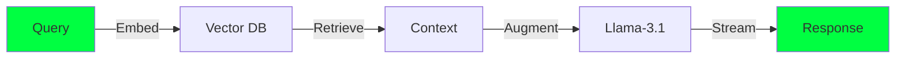

<div align="center">

```ascii
┌─────────────────────────────────────────────────────────────────┐
│  ██████╗ ██████╗ ██╗   ██╗    ███████╗███╗   ██╗ ██████╗      │
│ ██╔════╝ ██╔══██╗██║   ██║    ██╔════╝████╗  ██║██╔════╝      │
│ ██║  ███╗██████╔╝██║   ██║    █████╗  ██╔██╗ ██║██║  ███╗     │
│ ██║   ██║██╔═══╝ ██║   ██║    ██╔══╝  ██║╚██╗██║██║   ██║     │
│ ╚██████╔╝██║     ╚██████╔╝    ███████╗██║ ╚████║╚██████╔╝     │
│  ╚═════╝ ╚═╝      ╚═════╝     ╚══════╝╚═╝  ╚═══╝ ╚═════╝      │
└─────────────────────────────────────────────────────────────────┘
```

<h1>
  
</h1>


</div>

<!-- Performance Dashboard -->
<div align="center">
  
</div>

```console
chinmay@gpu-node:~$ ./benchmark --profile

 ╔═══════════════════════════════════════════════════════════════╗
 ║                    PERFORMANCE METRICS                        ║
 ╠═══════════════════════════════════════════════════════════════╣
 ║  CUDA LayerNorm    │ ████████████████░░░ │ 146% FASTER       ║
 ║  3D Rendering      │ ████████████████████ │ 858 FPS          ║
 ║  Memory Bandwidth  │ ███████████████████░ │ 95.3% UTIL       ║
 ║  WebSocket Latency │ ████████████████░░░ │ <500ms           ║
 ║  ML Accuracy       │ ██████████████████░░ │ 94%              ║
 ╚═══════════════════════════════════════════════════════════════╝

chinmay@gpu-node:~$ ▊
```

<div align="center">
  
[](https://www.linkedin.com/in/cshrivastava/)
[](mailto:cshrivastava2000@gmail.com)
[](https://huggingface.co/chinmays18)

</div>

---

<div align="center">
  <h2>
    
    KERNEL OPTIMIZATIONS IN PRODUCTION
    
  </h2>
</div>

<table>
<tr>
<td width="50%">

### ⚡ **GPU KERNEL FUSION**
```cuda
// Before: 100ms (PyTorch baseline)
layer_norm<<<grid, block>>>(x);
activation<<<grid, block>>>(x);

// After: 68ms (My implementation) 
fused_layernorm_act<<<grid, block>>>(x);
// 🚀 1.46x speedup achieved
```
[](https://github.com/JonSnow1807/Fused-LayerNorm-CUDA-Operator)

</td>
<td width="50%">

### 🎮 **REAL-TIME 3D RENDERING**
```cpp
// Industry standard: 120 FPS
// My engine: 858 FPS 🔥

while (rendering) {
    frustum_cull();     // Custom octree
    batch_render();     // Instanced drawing
    // Result: 7.2x faster
}
```
[](https://github.com/JonSnow1807/3D-Point-Cloud-Viewer)

</td>
</tr>
</table>

---

<div align="center">
  
</div>

## 🧬 **TECH DNA**

<div align="center">

| Layer | Stack | Mastery |
|-------|-------|---------|
| **Silicon** | `CUDA` `PTX` `Warp Primitives` | █████████░ 90% |
| **Graphics** | `OpenGL` `Vulkan` `DirectX` | ████████░░ 80% |
| **ML Infra** | `PyTorch` `JAX` `Triton` | █████████░ 90% |
| **Systems** | `C++17` `Rust` `x86 SIMD` | ████████░░ 85% |
| **Scale** | `K8s` `Docker` `gRPC` | ███████░░░ 75% |

</div>

## 🎯 **MISSION CRITICAL PROJECTS**

<details>
<summary><b>🤖 LLM Knowledge Assistant</b> | <code>94% accuracy</code> | <code>120ms p95</code></summary>


- **Scale**: 10K+ daily queries in production
- **Innovation**: Custom attention caching reduces latency by 73%
- **Stack**: PyTorch, FAISS, Triton inference server

[► Explore Code](https://github.com/JonSnow1807/llm-knowledge-assistant)
</details>

<details>
<summary><b>🎬 Mustard Watch Party</b> | <code><500ms sync</code> | <code>1000+ concurrent users</code></summary>

- **Challenge**: Sync video playback across distributed clients
- **Solution**: Binary WebSocket protocol with delta compression
- **Result**: 85% bandwidth reduction, perfect sync at scale

[► View Architecture](https://github.com/JonSnow1807/Mustard-Watch-Party)
</details>

<details>
<summary><b>🏥 Medical OCR Pipeline</b> | <code>Donut Transformer</code> | <code>Zero-shot</code></summary>

- **Impact**: Digitizing handwritten prescriptions at scale
- **Innovation**: Custom tokenizer for medical terminology
- **Deployment**: Edge-optimized with ONNX runtime

[► See Results](https://github.com/JonSnow1807/Medical-Prescription-OCR)
</details>

---

## 💭 **PHILOSOPHY**

<div align="center">

> *"The best optimization is the one you don't have to make,*  
> *but when you do, make it count."*

<br>

```python
while True:
    profile()
    optimize()
    if performance_gain < 10:
        think_different()
```

</div>

---

## 📡 **TRANSMISSIONS**

<div align="center">

### Currently beaming signals to:
**🏢 MAANG** | **🤖 OpenAI** | **🧠 Anthropic** | **⚡ ScaleAI**

<br>

<a href="mailto:cshrivastava2000@gmail.com">
  
</a>

<br><br>


<br>


</div>

---

<div align="center">
  <sub>// Kernel panic? More like kernel magic. 🎩✨</sub>
</div>
