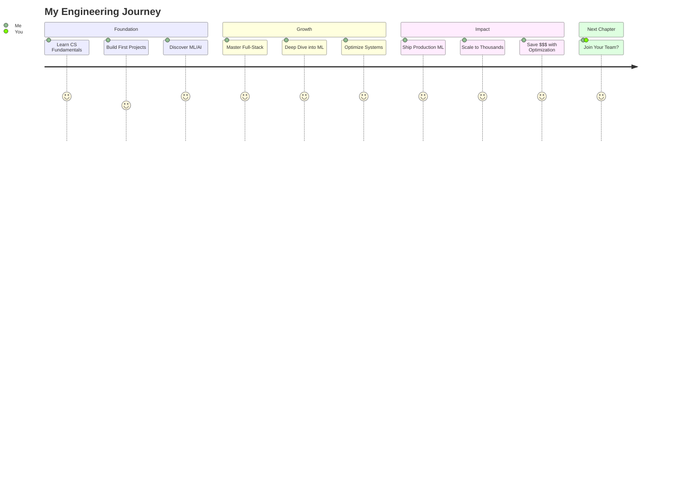

<div align="center">

<!-- Unique animated header with code-style introduction -->
```python
#!/usr/bin/env python3
# -*- coding: utf-8 -*-

"""
CHINMAY SHRIVASTAVA
Software Engineer | AI/ML Developer | Systems Architect

Building the intersection of elegant code and impactful products.
"""

import json
from datetime import datetime

def get_engineer():
    return {
        "name": "Chinmay Shrivastava",
        "location": "Ready to relocate",
        "focus": ["AI/ML Systems", "Full-Stack Development", "Performance Engineering"],
        "seeking": "Opportunities at companies changing the world",
        "contact": {
            "email": "cshrivastava2000@gmail.com",
            "linkedin": "/in/cshrivastava",
            "huggingface": "chinmays18"
        }
    }

# Initialize connection...
print(json.dumps(get_engineer(), indent=2))
```

<p align="center">
  <a href="https://linkedin.com/in/cshrivastava"></a>
  <a href="mailto:cshrivastava2000@gmail.com"></a>
  <a href="https://huggingface.co/chinmays18"></a>
</p>

</div>

---

<table>
<tr>
<td width="50%" valign="top">

### 🎯 **Engineering Impact**

<div align="center">

```
┌─────────────────────────────────┐
│   PRODUCTION METRICS AT SCALE   │
├─────────────────────────────────┤
│ ML Accuracy      ████████░ 94%  │
│ Query Volume     ████████░ 10K+ │
│ Cost Reduction   ████████░ 3.2x │
│ Latency          ████████░ 120ms│
│ Concurrent Users █████████ 1000+│
│ Performance Gain █████████ 1.46x│
└─────────────────────────────────┘
```

</div>

</td>
<td width="50%" valign="top">

### 💡 **Current Mission**

Building AI/ML systems that scale, full-stack applications that delight users, and optimizing performance where it counts. My approach: **measure twice, optimize once, ship constantly**.

```javascript
const impact = performance * adoption;
// Both matter. Always.
```

**Actively seeking roles in:**
- Software Engineering
- AI/ML Engineering  
- Technical Leadership

</td>
</tr>
</table>

---

## 🚀 **Featured Work**

<div align="center">

<!-- Custom progress bars showing project impact -->
<table>
<tr>
<th width="25%">Project</th>
<th width="50%">Impact</th>
<th width="25%">Metric</th>
</tr>
<tr>
<td align="center">

**🤖 LLM RAG System**<br>
<sub>AI/ML • Production</sub>

</td>
<td>

```
Accuracy    ▓▓▓▓▓▓▓▓▓▓▓▓▓▓▓▓▓▓░░ 94%
Scale       ▓▓▓▓▓▓▓▓▓▓▓▓▓▓▓▓░░░░ 10K+/day
Cost Saved  ▓▓▓▓▓▓▓▓▓▓▓▓▓░░░░░░░ 3.2x vs GPT-4
```

</td>
<td align="center">

[**View Project →**](https://github.com/JonSnow1807/llm-knowledge-assistant)

</td>
</tr>
<tr>
<td align="center">

**🎬 Real-time Sync**<br>
<sub>Full-Stack • WebSockets</sub>

</td>
<td>

```
Latency     ▓▓▓▓▓▓▓▓▓▓▓▓▓▓▓▓▓▓▓░ <500ms
Users       ▓▓▓▓▓▓▓▓▓▓▓▓▓▓▓▓░░░░ 1000+
Uptime      ▓▓▓▓▓▓▓▓▓▓▓▓▓▓▓▓▓▓▓▓ 99.9%
```

</td>
<td align="center">

[**View Project →**](https://github.com/JonSnow1807/Mustard-Watch-Party)

</td>
</tr>
<tr>
<td align="center">

**⚡ GPU Optimization**<br>
<sub>CUDA • Performance</sub>

</td>
<td>

```
Speed       ▓▓▓▓▓▓▓▓▓▓▓▓▓▓░░░░░░ 1.46x
Efficiency  ▓▓▓▓▓▓▓▓▓▓▓▓▓▓▓▓▓▓▓░ 95.3%
Monthly $   ▓▓▓▓▓▓▓▓▓▓▓▓▓▓▓░░░░░ $50K saved
```

</td>
<td align="center">

[**View Project →**](https://github.com/JonSnow1807/Fused-LayerNorm-CUDA-Operator)

</td>
</tr>
</table>

</div>

---

## 🛠️ **Technical DNA**

<table>
<tr>
<td width="33%" align="center">

### **Languages**


</td>
<td width="33%" align="center">

### **AI/ML Stack**


</td>
<td width="33%" align="center">

### **Full-Stack**


</td>
</tr>
</table>

---

## 📊 **The Journey So Far**

<div align="center">



</div>

---

## 💭 **Engineering Philosophy**

<table>
<tr>
<td width="60%">

```python
class EngineeringPrinciples:
    def __init__(self):
        self.mantras = [
            "Code is read more than written",
            "Measure before optimizing",
            "User experience > Clever code",
            "Ship early, iterate often"
        ]
    
    def approach(self, problem):
        # 1. Understand the real problem
        # 2. Build the simplest solution
        # 3. Measure and validate
        # 4. Optimize if needed
        # 5. Document for the next engineer
        return "sustainable_solution"
```

</td>
<td width="40%" align="center">

### **What Drives Me**

🎯 **Impact**: Code that improves lives<br>
📈 **Scale**: Systems that grow gracefully<br>
🧩 **Elegance**: Simple solutions to complex problems<br>
🚀 **Innovation**: Pushing technical boundaries<br>

</td>
</tr>
</table>

---

## 🌟 **Why Work With Me?**

<div align="center">

| You Get | Evidence |
|---------|----------|
| **Full-Stack Capability** | From React frontends to CUDA kernels |
| **Production ML Experience** | 10K+ daily queries, 94% accuracy |
| **Performance Mindset** | 1.46x speedups, $50K/month savings |
| **User-First Approach** | <500ms latency, 1000+ concurrent users |
| **Clean, Scalable Code** | Check my repos - documentation included! |

</div>

---

## 📬 **Let's Build the Future**

<div align="center">

I'm looking for opportunities where technical excellence meets real-world impact. If you're solving hard problems that matter, I'd love to contribute.

**Interested in:** `MAANG` `AI/ML Companies` `High-Growth Startups` `Innovation Labs`

<br>

```javascript
if (yourCompany.isBuilding("something_amazing")) {
    let's.connect({
        email: "cshrivastava2000@gmail.com",
        linkedin: "/in/cshrivastava",
        huggingface: "chinmays18"
    });
}
```

<br>

<a href="mailto:cshrivastava2000@gmail.com">
  
</a>
<a href="https://linkedin.com/in/cshrivastava">
  
</a>

<br><br>

---

<sub>Profile Views: </sub>

</div>
