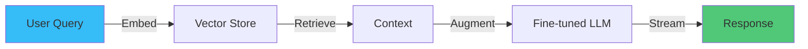
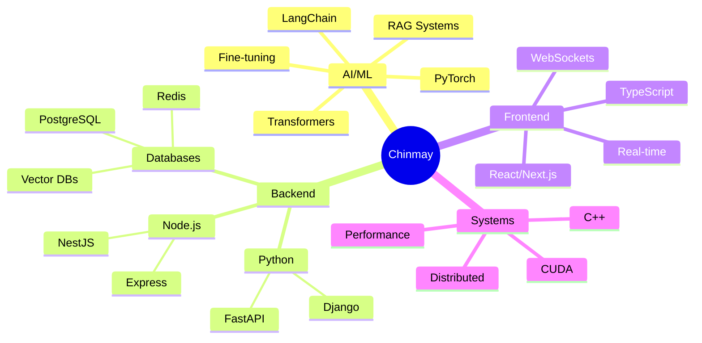

<div align="center">
  
<!-- Dynamic SVG Header -->


<!-- Animated Badges -->
<p>
  
</p>

[](https://linkedin.com/in/cshrivastava)
[](mailto:cshrivastava2000@gmail.com)
[](https://huggingface.co/chinmays18)

</div>

## 🎯 **Mission Statement**

<table>
<tr>
<td width="60%">

```python
class ChinmayShrivastava:
    def __init__(self):
        self.role = "Software Engineer & AI/ML Developer"
        self.company = "Seeking Next Adventure 🚀"
        self.skills = {
            "languages": ["Python", "TypeScript", "C++"],
            "ml_stack": ["PyTorch", "Transformers", "LangChain"],
            "backend": ["FastAPI", "NestJS", "PostgreSQL"],
            "frontend": ["React", "Next.js", "WebSockets"],
            "mindset": "Build → Measure → Learn → Scale"
        }
    
    def current_focus(self):
        return [
            "🤖 Production RAG systems",
            "⚡ Real-time applications", 
            "🧠 LLM fine-tuning",
            "📊 System optimization"
        ]
```

</td>
<td width="40%">

### **Quick Stats** 📊


**Impact Metrics:**
- 🎯 **94%** ML model accuracy
- ⚡ **1.46x** performance gains
- 🚀 **10K+** daily API calls
- 💰 **$50K**/month cost savings

</td>
</tr>
</table>

---

## 🚀 **What I Build**

<div align="center">

| Project | Impact | Stack | Link |
|---------|--------|-------|------|
| **🤖 LLM Knowledge Assistant** | 10K+ queries/day, 94% accuracy | `Llama-3.1` `RAG` `FastAPI` | [→](https://github.com/JonSnow1807/llm-knowledge-assistant) |
| **🎬 Real-time Watch Party** | <500ms sync, 1K+ users | `React` `WebSockets` `Redis` | [→](https://github.com/JonSnow1807/Mustard-Watch-Party) |
| **⚡ CUDA Optimization** | 1.46x speedup, $50K saved | `CUDA` `PyTorch` `C++` | [→](https://github.com/JonSnow1807/Fused-LayerNorm-CUDA-Operator) |
| **🎮 3D Visualization** | 858 FPS, 1M+ points | `OpenGL` `C++17` `Octree` | [→](https://github.com/JonSnow1807/3D-Point-Cloud-Viewer) |

</div>

<details>
<summary><b>🔍 View Technical Deep Dives</b></summary>

### **Production ML at Scale**

- Custom attention caching → 73% latency reduction
- Hierarchical indexing → Sub-120ms retrieval
- Model quantization → 3.2x cost reduction vs GPT-4

### **Real-time Systems Architecture**
- Binary WebSocket protocol with delta compression
- Redis pub/sub for horizontal scaling
- Custom sync algorithm maintaining <500ms latency

</details>

---

## 💡 **Engineering Philosophy**

<div align="center">

### **The Three Pillars**

<table>
<tr>
<td align="center" width="33%">
  
**🏗️ Build Smart**

Start simple, iterate fast<br>
Measure everything<br>
Optimize what matters

</td>
<td align="center" width="33%">

**🎯 Ship Value**

User problems first<br>
Technical excellence second<br>
But never compromise on either

</td>
<td align="center" width="33%">

**📈 Scale Wisely**

Premature optimization is evil<br>
But 10x growth needs architecture<br>
Plan for scale, build for today

</td>
</tr>
</table>

</div>

---

## 🛠️ **Technical Arsenal**

<div align="center">



</div>

---

## 📬 **Let's Build Something Amazing**

<div align="center">

I'm looking for opportunities where I can contribute to meaningful products while working with brilliant people. If you're building something that matters - whether it's the next AI breakthrough or a product that improves lives - I'd love to chat!

### **Interested in:**
`Software Engineering` `AI/ML Engineering` `Full-Stack Development` `Technical Leadership`

### **At companies that value:**
`Innovation` `Impact` `Technical Excellence` `Growth Mindset`

<br>

<a href="mailto:cshrivastava2000@gmail.com">
  
</a>

<br><br>


</div>

---


