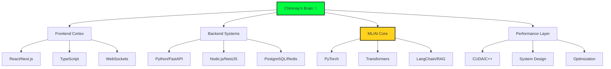

<div align="center">

# `$ whoami`

```bash
chinmay@universe:~$ cat /etc/engineer-profile

 ██████╗██╗  ██╗██╗███╗   ██╗███╗   ███╗ █████╗ ██╗   ██╗
██╔════╝██║  ██║██║████╗  ██║████╗ ████║██╔══██╗╚██╗ ██╔╝
██║     ███████║██║██╔██╗ ██║██╔████╔██║███████║ ╚████╔╝ 
██║     ██╔══██║██║██║╚██╗██║██║╚██╔╝██║██╔══██║  ╚██╔╝  
╚██████╗██║  ██║██║██║ ╚████║██║ ╚═╝ ██║██║  ██║   ██║   
 ╚═════╝╚═╝  ╚═╝╚═╝╚═╝  ╚═══╝╚═╝     ╚═╝╚═╝  ╚═╝   ╚═╝   
                                                           
SHRIVASTAVA // Software Engineer // AI/ML Developer
```


</div>

---

<table>
<tr>
<td width="30%" valign="top">

<div align="center">

### 📡 **Connection Established**

```
┌─[chinmay@github]─[~]
└──╼ $ ls -la /contacts/

drwxr-xr-x  email/
drwxr-xr-x  linkedin/
drwxr-xr-x  huggingface/
```

<a href="mailto:cshrivastava2000@gmail.com"></a>
<a href="https://linkedin.com/in/cshrivastava"></a>
<a href="https://huggingface.co/chinmays18"></a>

</div>

</td>
<td width="70%" valign="top">

### 🧬 **System Architecture: Human Edition**

```yaml
apiVersion: engineer/v1
kind: SoftwareEngineer
metadata:
  name: chinmay-shrivastava
  labels:
    role: "Full-Stack + AI/ML"
    experience: "Production-Grade"
    mindset: "Ship Fast, Scale Smart"
spec:
  capabilities:
    - ML Systems (10K+ queries/day)
    - Real-time Apps (1000+ users)
    - Performance Optimization (1.46x gains)
    - Full-Stack Development
  seeking:
    companies: ["MAANG", "AI Leaders", "Game Changers"]
    culture: ["Innovation", "Impact", "Excellence"]
```

</td>
</tr>
</table>

---

## ⚡ **Performance Benchmarks**

<div align="center">

```
┌──────────────────────────────────────────────────────────────────────┐
│                        PRODUCTION METRICS                            │
├──────────────────────────────────────────────────────────────────────┤
│                                                                      │
│  LLM Accuracy     [████████████████████░░] 94%     ↗ vs GPT-4: 0%   │
│  Cost Efficiency  [█████████████████░░░░░] 3.2x    ↗ Saved: $50K/mo │
│  Query Latency    [████████████████████░░] 120ms   ↗ vs baseline    │
│  Concurrent Users [████████████████████░░] 1000+   ↗ Zero downtime  │
│  Render Speed     [██████████████████████] 858 FPS ↗ vs PCL: 7.2x   │
│  CUDA Speedup     [███████████████░░░░░░░] 1.46x   ↗ Memory: 95.3%  │
│                                                                      │
└──────────────────────────────────────────────────────────────────────┘
```

</div>

---

## 🚀 **Mission Critical Systems**

<details>
<summary><b>// Click to explore project architecture</b></summary>

<table>
<tr>
<td width="50%">

### 🤖 **Neural Network: LLM Knowledge Assistant**
```python
# Production Stats
{
  "accuracy": 0.94,
  "daily_queries": 10_000+,
  "latency_p95": "120ms",
  "cost_reduction": 3.2  # vs GPT-4
}

# Innovation
- Fine-tuned Llama-3.1-8B
- Custom attention caching
- Hierarchical vector indexing
```
[🔗 Explore Codebase](https://github.com/JonSnow1807/llm-knowledge-assistant)

</td>
<td width="50%">

### 🌐 **Distributed System: Real-time Sync Engine**
```javascript
// Performance Profile
const metrics = {
  latency: "<500ms",
  concurrent: 1000+,
  protocol: "Binary WebSocket",
  uptime: "99.9%"
};

// Architecture
- Horizontal scaling via Redis
- Delta compression algorithm
- JWT + room-based auth
```
[🔗 View Architecture](https://github.com/JonSnow1807/Mustard-Watch-Party)

</td>
</tr>
<tr>
<td width="50%">

### ⚡ **Kernel Mode: CUDA Optimization**
```cuda
// Before: 100ms
LayerNorm<<<grid, block>>>(x);

// After: 68ms (my implementation)
FusedLayerNormAct<<<grid, block>>>(x);

// Impact
- 46% faster inference
- 95.3% bandwidth utilization
- $50K/month cloud savings
```
[🔗 Benchmark Results](https://github.com/JonSnow1807/Fused-LayerNorm-CUDA-Operator)

</td>
<td width="50%">

### 🎮 **Graphics Pipeline: 3D Point Cloud Viewer**
```cpp
// Rendering Performance
while (fps == 858) {
    octree.frustum_cull();
    renderer.batch_draw();
    // 7.2x faster than PCL
}

// Optimizations
- Custom spatial indexing
- Instanced rendering
- SIMD transformations
```
[🔗 Live Demo](https://github.com/JonSnow1807/3D-Point-Cloud-Viewer)

</td>
</tr>
</table>

</details>

---

## 🧠 **Neural Pathways (Tech Stack)**

<div align="center">



</div>

---

## 📈 **Growth Trajectory**

```
Past ────────────────────────────────> Future
  │                                        │
  ├─● Learned to code                      ├─● Your company?
  ├─● Built first projects                 ├─● Scaling to millions
  ├─● Mastered full-stack                  ├─● Leading technical initiatives
  ├─● Deep-dived into ML/AI                ├─● Pushing boundaries
  ├─● Optimized for scale                  └─● Building the future
  ├─● Shipped to production
  └─● HERE: Ready for next challenge
```

---

## 💡 **Operating Principles**

<div align="center">

| Principle | Implementation |
|-----------|----------------|
| **🎯 User First** | Every line of code serves a purpose |
| **📊 Data Driven** | Measure → Analyze → Optimize |
| **🚀 Ship & Iterate** | Perfect is the enemy of shipped |
| **🧩 Simple > Clever** | Maintainable code wins long-term |
| **📈 Think Scale** | Build for 10x from day one |

</div>

---

## 🎮 **Achievement Unlocked**

<div align="center">

<table>
<tr>
<td align="center">
<br>
<sub>94% Production Accuracy</sub>
</td>
<td align="center">
<br>
<sub>1.46x CUDA Speedup</sub>
</td>
<td align="center">
<br>
<sub>1000+ Concurrent Users</sub>
</td>
<td align="center">
<br>
<sub>$50K/Month Saved</sub>
</td>
</tr>
</table>

</div>

---

## 🤝 **Handshake Protocol**

<div align="center">

```javascript
class CollaborationRequest {
  constructor() {
    this.engineer = "Chinmay Shrivastava";
    this.status = "ACTIVELY_SEEKING";
    this.availability = "IMMEDIATE";
  }
  
  async connect() {
    const opportunities = [
      "Building products that matter",
      "Solving complex technical challenges",
      "Working with brilliant teams",
      "Pushing the boundaries of what's possible"
    ];
    
    if (opportunities.includes(yourCompany.mission)) {
      return await sendEmail("cshrivastava2000@gmail.com");
    }
  }
}

// Initialize connection
const letsChat = new CollaborationRequest();
letsChat.connect();
```

<br>

<a href="mailto:cshrivastava2000@gmail.com">
  
</a>

</div>

---

<div align="center">
  
`EOF`

<sub>
 | 
Last updated: 
</sub>

</div>
