```mermaid
graph LR
    subgraph "Frontend Excellence"
        A[React/Next.js] --> B[TypeScript]
        B --> C[Real-time UX]
    end
    
    subgraph "Backend Systems"
        D[Python/FastAPI] --> E[Node.js/NestJS]
        E --> F[PostgreSQL/Redis]
    end
    
    subgraph "AI/ML Pipeline"
        G[PyTorch] --> H[Transformers]
        H --> I[Production RAG]
    end
    
    subgraph "Performance Layer"
        J[CUDA] --> K[C++]
        K --> L[System Design]
    end
    
    C -.-> D
    F -.-> G
    I -.-> J
    
    style A fill:#3494E6,color:#fff
    style G fill:#EC6EAD,color:#fff
    style J fill:#3494E6,color:#fff
```

<div align="center">

<!-- Custom banner with gradient effect -->


<p align="center">
  <a href="https://linkedin.com/in/cshrivastava"></a>&nbsp;&nbsp;
  <a href="mailto:cshrivastava2000@gmail.com"></a>&nbsp;&nbsp;
  <a href="https://huggingface.co/chinmays18"></a>
</p>

</div>

<br>

<div align="center">
  <table>
    <tr>
      <td align="center" width="33%">
        
        <br>
        <b>94% Accuracy</b> • 10K+ Daily Queries
      </td>
      <td align="center" width="33%">
        
        <br>
        <b><500ms Latency</b> • 1000+ Users
      </td>
      <td align="center" width="33%">
        
        <br>
        <b>1.46x Speedup</b> • $50K Saved
      </td>
    </tr>
  </table>
</div>

---

<h2 align="center">💫 Building Technology That Matters</h2>

<div align="center">
  
</div>

<br>

<table>
<tr>
<td width="50%">

### 🎯 **Impact by Numbers**

```yaml
Production Scale:
  Daily Queries: 10,000+
  Concurrent Users: 1,000+
  Uptime: 99.9%
  
Performance Gains:
  ML Inference: 1.46x faster
  Cost Reduction: $50K/month
  Latency: <120ms p95
  
Engineering Velocity:
  From Idea → MVP: Days
  MVP → Production: Weeks
  Production → Scale: Proven
```

</td>
<td width="50%">

### 🚀 **Core Strengths**

- **Full-Stack Engineering**: React to Redis, pixels to pipelines
- **AI/ML Systems**: Production RAG, fine-tuning, optimization
- **Performance**: When every millisecond costs money
- **Scale Thinking**: Built for 10x growth from day one

<br>

**Currently seeking roles where:**
- Technical excellence meets business impact
- Innovation is encouraged and rewarded
- Scale is not just a future problem

</td>
</tr>
</table>

---

<h2 align="center">🛠️ Technical Architecture</h2>

<div align="center">



</div>

---

<h2 align="center">📊 Engineering Philosophy</h2>

<br>

<div align="center">
  
</div>

<br>

<table>
<tr>
<td align="center" width="25%">
  
**🎯 User First**

Every line of code should improve someone's life

</td>
<td align="center" width="25%">

**📊 Data Driven**

Opinions are good, metrics are better

</td>
<td align="center" width="25%">

**🚀 Ship Fast**

Progress over perfection, always

</td>
<td align="center" width="25%">

**♾️ Think Scale**

Build for tomorrow's problems today

</td>
</tr>
</table>

---

<h2 align="center">🌟 What Sets Me Apart</h2>

<div align="center">

| Capability | Evidence |
|:-----------|:---------|
| **Full Product Ownership** | Shipped end-to-end: frontend → backend → ML → production |
| **Performance Obsession** | 1.46x CUDA speedup, 858 FPS rendering, <120ms ML inference |
| **Scale Experience** | Systems handling 10K+ daily queries, 1000+ concurrent users |
| **Business Impact** | $50K/month saved through optimization, 94% accuracy in production |
| **Rapid Iteration** | From concept to production-ready in weeks, not months |

</div>

---

<h2 align="center">🤝 Let's Build the Future Together</h2>

<div align="center">

I'm passionate about joining a team where **ambitious technical challenges** meet **real-world impact**. 

Whether you're revolutionizing AI, building the next unicorn, or solving problems that matter, I bring the technical depth and product mindset to help you succeed.

<br>

**🎯 Actively exploring opportunities in:**

`Software Engineering` • `AI/ML Engineering` • `Technical Leadership` • `Performance Engineering`

<br>

<a href="mailto:cshrivastava2000@gmail.com">
  
</a>
&nbsp;
<a href="https://linkedin.com/in/cshrivastava">
  
</a>

<br><br>


</div>


