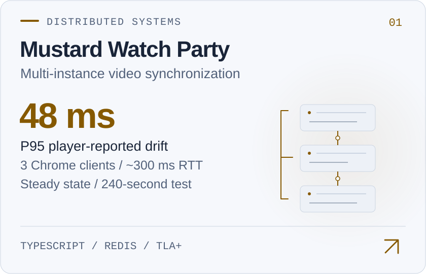
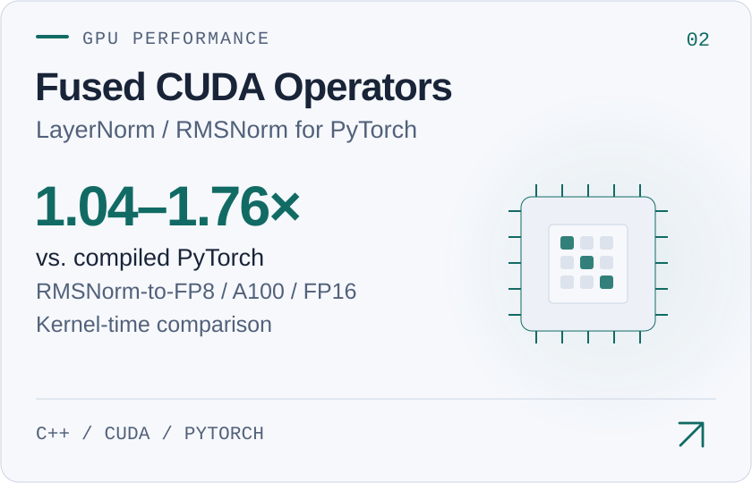
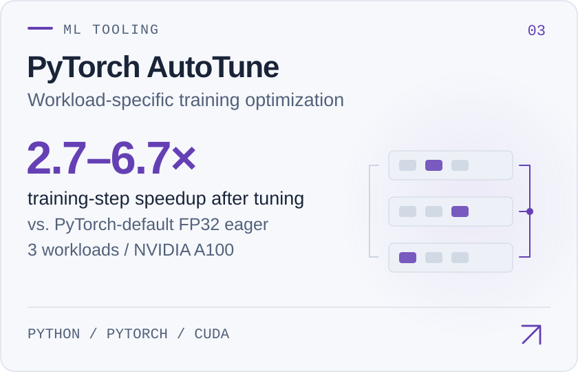
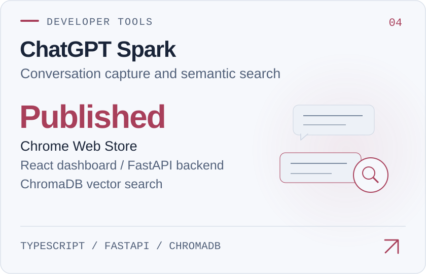

<!-- Upload this README and assets/profile/ to JonSnow1807/JonSnow1807 together. -->

<picture>
  <source media="(max-width: 640px) and (prefers-color-scheme: dark)" srcset="./assets/profile/hero-mobile-dark.svg">
  <source media="(max-width: 640px) and (prefers-color-scheme: light)" srcset="./assets/profile/hero-mobile-light.svg">
  <source media="(prefers-color-scheme: dark)" srcset="./assets/profile/hero-dark.svg">
  
</picture>

  <a href="https://www.linkedin.com/in/cshrivastava/"><picture><source media="(prefers-color-scheme: dark)" srcset="./assets/profile/linkedin-dark.svg"></picture></a>
  <a href="mailto:cshrivastava2000@gmail.com"><picture><source media="(prefers-color-scheme: dark)" srcset="./assets/profile/email-dark.svg"></picture></a>
  <a href="https://huggingface.co/chinmays18"><picture><source media="(prefers-color-scheme: dark)" srcset="./assets/profile/huggingface-dark.svg"></picture></a>

**I build high-performance backend and ML infrastructure, and I validate it against references instead of trusting it.**

At **Reliance Jio**, I work on production 4G/5G analytics, deterministic query compilation and GPU-backed inference on Kubernetes/OpenShift, including a **13-node, air-gapped, IPv6-only deployment**. Outside work, I contribute to PyTorch and bpfilter, and build tools for GPU performance and distributed coordination.

## 01 / Upstream contributions

**PyTorch core** — two accepted changes  
Enabled existing dynamic-shape support for foreach operations by default under `torch.compile`, with a test update ([#158985](https://github.com/pytorch/pytorch/pull/158985)). Exposed `rearrange` through the `torch.func` public API, with tests and documentation ([#173183](https://github.com/pytorch/pytorch/pull/173183)).

**Meta’s bpfilter** — two merged pull requests  
Added IPv4 Type of Service and IPv6 Traffic Class matchers, including command-line parsing, BPF code generation and unit tests ([#364](https://github.com/facebook/bpfilter/pull/364), [#369](https://github.com/facebook/bpfilter/pull/369)). The IPv6 implementation uses endianness-safe byte loads.

PyTorch landing commits: <a href="https://github.com/pytorch/pytorch/commit/51eb41a57ef4365bece0c187f1d751221b88c135">foreach</a> · <a href="https://github.com/pytorch/pytorch/commit/cd59c879a7eb47de27e0eead455b0b0349c12488">rearrange</a>.

## 02 / Selected builds

<!-- Fixed, equal image widths let cards wrap naturally instead of squeezing table columns. -->
<!-- Each card opens its repository; the button row beneath a pair links the shipped/measured destination and the source. -->

  <a href="https://github.com/JonSnow1807/Mustard-Watch-Party"><picture><source media="(max-width: 640px) and (prefers-color-scheme: dark)" srcset="./assets/profile/mustard-mobile-dark.svg"><source media="(max-width: 640px) and (prefers-color-scheme: light)" srcset="./assets/profile/mustard-mobile-light.svg"><source media="(prefers-color-scheme: dark)" srcset="./assets/profile/mustard-dark.svg"></picture></a>
  <a href="https://github.com/JonSnow1807/Fused-LayerNorm-CUDA-Operator"><picture><source media="(max-width: 640px) and (prefers-color-scheme: dark)" srcset="./assets/profile/cuda-mobile-dark.svg"><source media="(max-width: 640px) and (prefers-color-scheme: light)" srcset="./assets/profile/cuda-mobile-light.svg"><source media="(prefers-color-scheme: dark)" srcset="./assets/profile/cuda-dark.svg"></picture></a>

  <a href="https://mustard.watch"><picture><source media="(prefers-color-scheme: dark)" srcset="./assets/profile/link-mustard-live-dark.svg"></picture></a>
  <a href="https://github.com/JonSnow1807/Mustard-Watch-Party"><picture><source media="(prefers-color-scheme: dark)" srcset="./assets/profile/link-mustard-source-dark.svg"></picture></a>
  &nbsp;&nbsp;
  <a href="https://github.com/JonSnow1807/Fused-LayerNorm-CUDA-Operator/tree/main/benchmarks/results/2026-08-25_a100-40gb_v050_ops"><picture><source media="(prefers-color-scheme: dark)" srcset="./assets/profile/link-cuda-benchmarks-dark.svg"></picture></a>
  <a href="https://github.com/JonSnow1807/Fused-LayerNorm-CUDA-Operator"><picture><source media="(prefers-color-scheme: dark)" srcset="./assets/profile/link-cuda-source-dark.svg"></picture></a>

  <a href="https://github.com/JonSnow1807/pytorch-autotune"><picture><source media="(max-width: 640px) and (prefers-color-scheme: dark)" srcset="./assets/profile/autotune-mobile-dark.svg"><source media="(max-width: 640px) and (prefers-color-scheme: light)" srcset="./assets/profile/autotune-mobile-light.svg"><source media="(prefers-color-scheme: dark)" srcset="./assets/profile/autotune-dark.svg"></picture></a>
  <a href="https://github.com/JonSnow1807/chatgpt-memory-manager"><picture><source media="(max-width: 640px) and (prefers-color-scheme: dark)" srcset="./assets/profile/spark-mobile-dark.svg"><source media="(max-width: 640px) and (prefers-color-scheme: light)" srcset="./assets/profile/spark-mobile-light.svg"><source media="(prefers-color-scheme: dark)" srcset="./assets/profile/spark-dark.svg"></picture></a>

  <a href="https://pypi.org/project/pytorch-autotune/"><picture><source media="(prefers-color-scheme: dark)" srcset="./assets/profile/link-autotune-pypi-dark.svg"></picture></a>
  <a href="https://github.com/JonSnow1807/pytorch-autotune"><picture><source media="(prefers-color-scheme: dark)" srcset="./assets/profile/link-autotune-source-dark.svg"></picture></a>
  &nbsp;&nbsp;
  <a href="https://chromewebstore.google.com/detail/chatgpt-spark/bieoffmnblcajoahiljjbhffeccojpop"><picture><source media="(prefers-color-scheme: dark)" srcset="./assets/profile/link-spark-webstore-dark.svg"></picture></a>
  <a href="https://github.com/JonSnow1807/chatgpt-memory-manager"><picture><source media="(prefers-color-scheme: dark)" srcset="./assets/profile/link-spark-source-dark.svg"></picture></a>

### Inside the projects

<strong>Mustard</strong> · Clock synchronization, protocol correctness and runtime trade-offs

Mustard is a multi-instance watch-party platform: clients connect over WebSockets and use NTP-style clock estimation with predictive drift correction, and updates go through atomic Redis Lua scripts. The **48 ms P95** is a specific claim: **steady-state player-reported drift**, measured across **three Chrome clients** at approximately **300 ms RTT** during a **240-second test**. It is not a physical audio-output measurement.

Protocol correctness was a separate question. TLA+/TLC model checking exposed a stale-epoch bug after store resets, leading to an ordered-epoch fix, and idempotency keys plus atomic updates keep control commands from being applied twice within the deduplication window.

I also built **Go and Rust relays** to test protocol conformance and runtime costs. They are study implementations, not the production backend. In a local 10,000-connection test, the Rust relay used 14.5 KB of memory per connection versus 40 KB for Go; the extreme-tail latency comparison was inconclusive.

[Live site](https://mustard.watch) · [Source](https://github.com/JonSnow1807/Mustard-Watch-Party) · [Sync design](https://github.com/JonSnow1807/Mustard-Watch-Party/blob/main/docs/SYNC_DESIGN.md) · [TLA+ findings](https://github.com/JonSnow1807/Mustard-Watch-Party/blob/main/docs/FORMAL.md) · [Go/Rust study](https://github.com/JonSnow1807/Mustard-Watch-Party/blob/main/relay-rs/README.md)

<strong>Fused CUDA operators</strong> · Custom ops, deterministic gradients and FP8

These LayerNorm/RMSNorm kernels combine **fused residual-add**, **FP8 outputs** and **deterministic backward reductions**, and come as drop-in PyTorch modules that work under `torch.compile` without graph breaks. Parameter gradients use fixed-order reductions rather than atomic accumulation, which is where the determinism comes from.

For dynamic RMSNorm-to-FP8, I measured **4.9–7.2× over the eager PyTorch composite** and **1.04–1.76× over the compiled composite**, across tested **FP16 shapes on an NVIDIA A100**. Those are **kernel-time comparisons**, not end-to-end model speedups. For a fuller picture, the repository also documents H100 results and configurations where PyTorch wins.

[Source](https://github.com/JonSnow1807/Fused-LayerNorm-CUDA-Operator) · [A100 results](https://github.com/JonSnow1807/Fused-LayerNorm-CUDA-Operator/tree/main/benchmarks/results/2026-08-25_a100-40gb_v050_ops) · [Methodology](https://github.com/JonSnow1807/Fused-LayerNorm-CUDA-Operator/blob/main/docs/methodology.md)

<strong>PyTorch AutoTune</strong> · Measure the configuration instead of guessing it

Rather than guess at a training configuration, the tuner benchmarks **precision, compile mode, memory format and fused-optimizer configurations** on the target model and batch. Search runs under a budget, configurations are cached for reuse, and reports show trial results, compilation cost and estimated break-even time.

I measured **2.7–6.7× training-step speedups after tuning** versus the **PyTorch-default FP32 eager baseline** across **ResNet-50, ResNet-18 and a six-layer Transformer on an NVIDIA A100**, with the tuner using `torch.compile` alongside the other optimizations. The baseline matters, though: on the Transformer, the gain is **2.55×** against an eager baseline with TF32 matmuls enabled, rather than 6.65× against the defaults. Search costs and numerical trade-offs are documented as well.

[PyPI](https://pypi.org/project/pytorch-autotune/) · [Source](https://github.com/JonSnow1807/pytorch-autotune) · [Benchmark artifacts](https://github.com/JonSnow1807/pytorch-autotune/tree/main/benchmarks/results/2026-08-25_a100-40gb_v200)

<strong>ChatGPT Spark</strong> · A shipped extension and its retrieval backend

Spark is a Chrome extension I built and published for capturing and searching conversation history. A **React/TypeScript dashboard** lets you browse saved conversations, **FastAPI** handles backend requests, and **ChromaDB** stores the embeddings behind semantic search.

[Source](https://github.com/JonSnow1807/chatgpt-memory-manager) · [Chrome Web Store](https://chromewebstore.google.com/detail/chatgpt-spark/bieoffmnblcajoahiljjbhffeccojpop)

Also built: **[3D Point Cloud Viewer](https://github.com/JonSnow1807/3D-Point-Cloud-Viewer)** — C++/OpenGL, octree-based culling and level-of-detail rendering.

## 03 / Toolbox

| Area | Tools I use |
| :--- | :--- |
| **Languages** | C++, C, Python, Rust, Go, CUDA, TypeScript, SQL |
| **Backend & data** | FastAPI, NestJS, WebSockets, SSE, ClickHouse, PostgreSQL/PostGIS, Redis, ChromaDB |
| **Infrastructure** | Linux, Docker, Kubernetes/OpenShift, AWS, CI/CD |
| **ML & performance** | PyTorch, `torch.compile`, vLLM, GPU profiling, kernel fusion, benchmark design |
| **Correctness** | TLA+/TLC, reference-based tests, regression tests, protocol-conformance checks |

<picture>
  <source media="(prefers-color-scheme: dark)" srcset="./assets/profile/endmark-dark.svg">
  
</picture>

**Have a systems problem worth digging into?**  
I’m interested in backend, distributed-systems, ML-infrastructure and performance-engineering work.

**Frisco, Texas · Open to relocation**  
[Email](mailto:cshrivastava2000@gmail.com) · [LinkedIn](https://www.linkedin.com/in/cshrivastava/) · [Hugging Face](https://huggingface.co/chinmays18)
